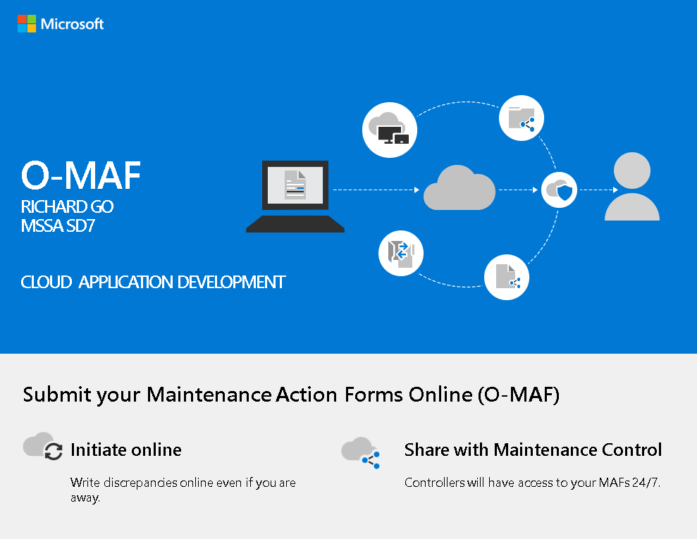

[Back to prototype](https://github.com/gowebUSA/MSSA-Project/tree/master/TSQL/Project-Step-7/prototype#table-of-contents)
## O-MAF Project

Using O MAF will enable maintenance controllers to
effectively manage all MAFs and set priorities.
Efficiency will be increased by 67% based on
previous studies done by Certified Lean Six Sigma
Green Belt.

### Table Of Contents
- [X] [0. O-MAF Concept](O-MAF%20Concept.pdf)- .pdf
- [X] [1. User Stories (2-5)](User%20Story.pdf)- .pdf
- [ ] 2. Use Cases (4-10)
- [X] [3. User Case Diagram UML](#user-case-uml)
- [X] [4. Wire Frame](https://github.com/gowebUSA/MSSA-Project/tree/master/TSQL/Project-Step-7/Wire%20Frame)
- [X] [5. Requirement List and RTM](Requirement%20List%20and%20RTM.pdf)- .pdf
- [X] [6. O-MAF SRS](O-MAF%20srs.pdf)- .pdf
- [X] [7. O-MAF SQL Queries](https://github.com/gowebUSA/MSSA-Project/blob/master/T-SQL/o_maf.sql) - .sql
- [X] [8. Prototype](https://github.com/gowebUSA/MSSA-Project/tree/master/TSQL/Project-Step-7/prototype)

### User Case UML

[Back to prototype](https://github.com/gowebUSA/MSSA-Project/tree/master/TSQL/Project-Step-7/prototype#table-of-contents)
